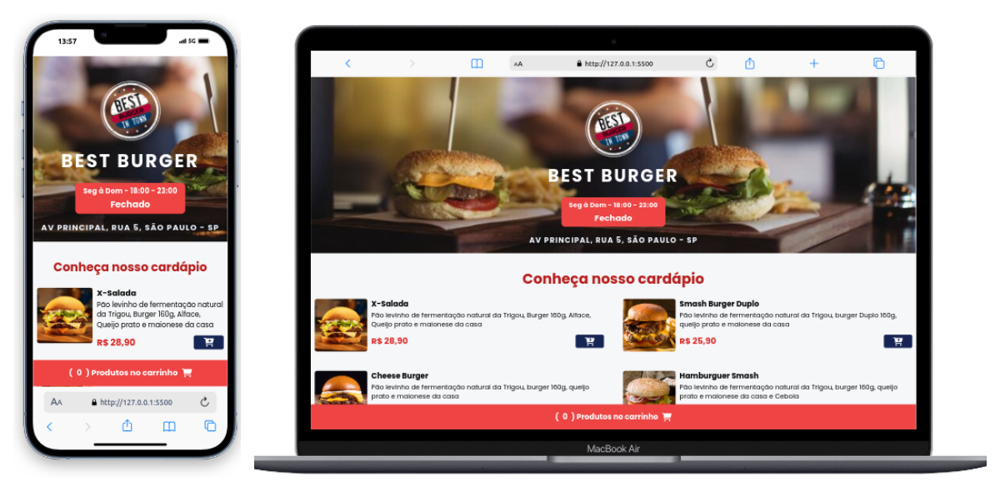

<h1 align="center">Hamburgueria Best Burger</h1>

### Projeto Hamburgueria Delivery

  

 

  
  
  
    

## Descrição

Este é um projeto simples porém que utiliza tecnologias de ponta como:

- **HTML**: Para estruturar nosso conteúdo.
- **CSS**: Para estilizar e tornar nosso layout responsivo
- **TAILWIND**: Um Framework Css focado em projetar interfaces de usuario personalizadas de forma rápida e eficiente
- **JAVASCRIPT**: Para interação dinamica dentro do app para manipular uma lista de produtos simulando uma hamburgueria delivery. O projeto possui as seguintes funcionalidades:

- Adicionar produtos ao carrinho
- Remover produtos do carrinho
- Alterar quantidade de produtos no carrinho
- Calcular o valor total do carrinho
- Mostrar o valor total do carrinho
- Campo de endereço para entrega

## Pré-requisitos

Um navegador de internet para abrir e visualizar o projeto.
Como rodar o projeto
Abra o arquivo HTML em um navegador de internet.
Construído com
HTML
CSS
JavaScript
Tailwind
Bootstrap

### Uso do Projeto:

1. Certifique-se de ter acesso aos elementos HTML correspondentes, como botões e listas.
2. Explore as funcionalidades, como exibição da lista, mapeamento, soma e filtragem.
3. Utilize o método `formatarMoeda(valor)` para formatar valores monetários.

## Licença

Este projeto está licenciado sob a Licença MIT. Consulte o arquivo [LICENSE](./LICENSE) para mais detalhes.

## Autor

Ricardo Alexandre Costa

## Contato

## Agradecimentos

- [Google Fonts](https://fonts.google.com/) - Fontes utilizadas no projeto

---

Essa é uma breve descrição do projeto e suas funcionalidades principais. Sinta-se à vontade para explorar e expandir esse projeto conforme necessário! 😊
